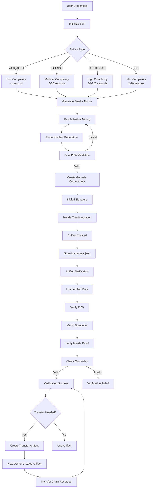
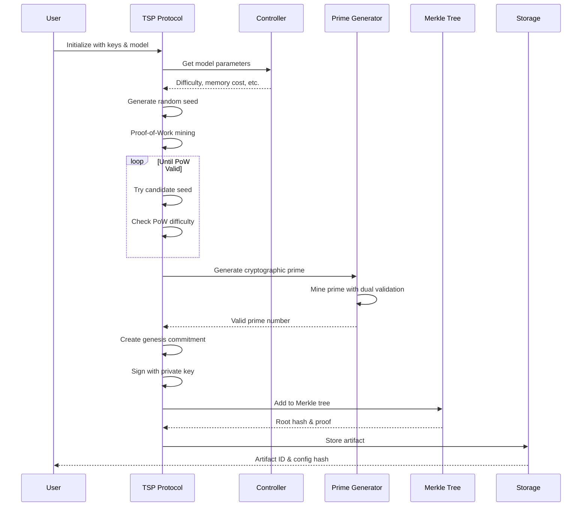
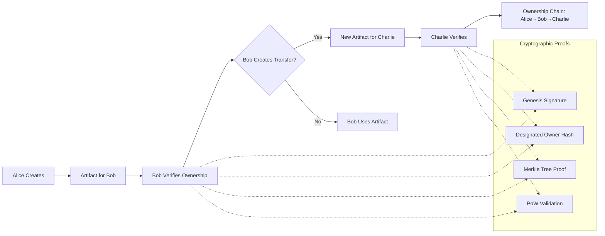
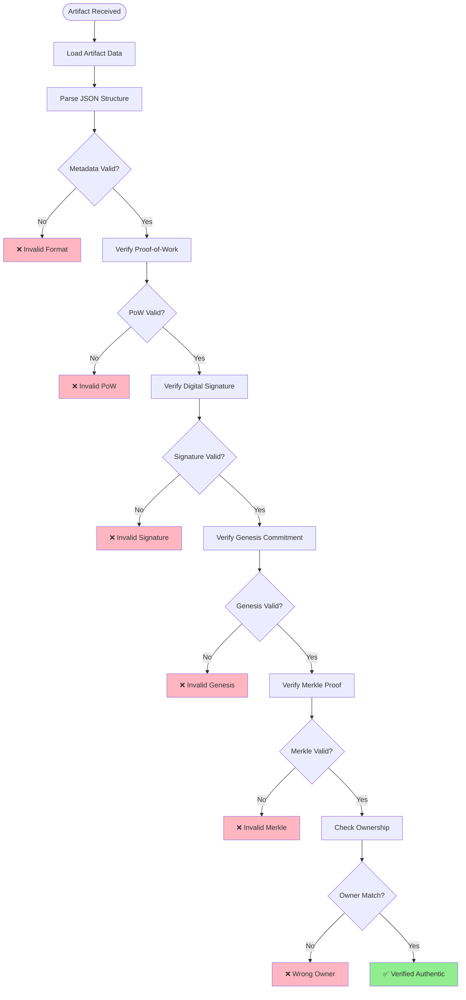
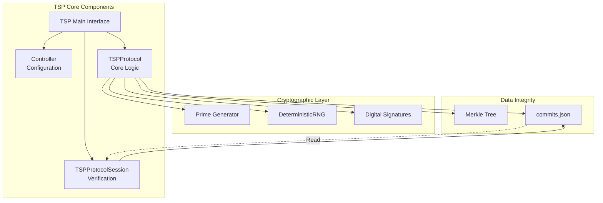
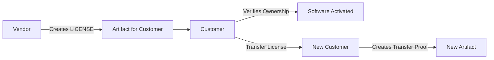
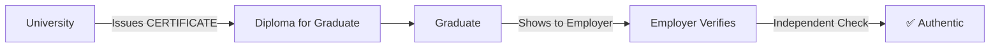
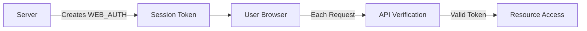

# TSP Protocol - Visual Workflow

**Copyright (c) 2025 Vladislav Dunaev. All rights reserved.**  
**SPDX-License-Identifier: AGPL-3.0-or-Commercial**

This document contains visual diagrams and architectural documentation for TrueState Protocol (TSP).

## Complete TSP Lifecycle Diagram

## Artifact Creation Process

## Ownership Chain Verification

## Security Verification Flow

## Component Architecture

## Use Case Examples

### Software Licensing Flow

### Digital Certificate Flow  

### Web Authentication Flow

---

## Integration Points

Add these diagrams to your documentation:

1. **README.md** - Include the main workflow diagram
2. **Architecture documentation** - Component diagram
3. **API documentation** - Sequence diagrams
4. **Security documentation** - Verification flow
5. **Examples** - Use case specific flows

These visual guides will significantly improve adoption by making the protocol easier to understand and implement.